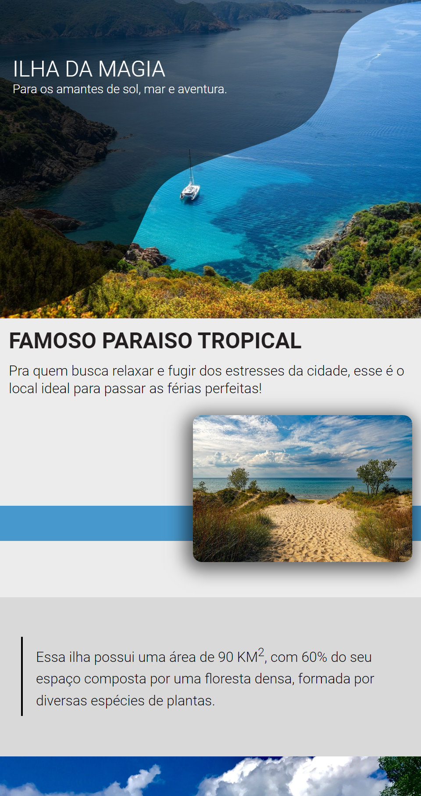
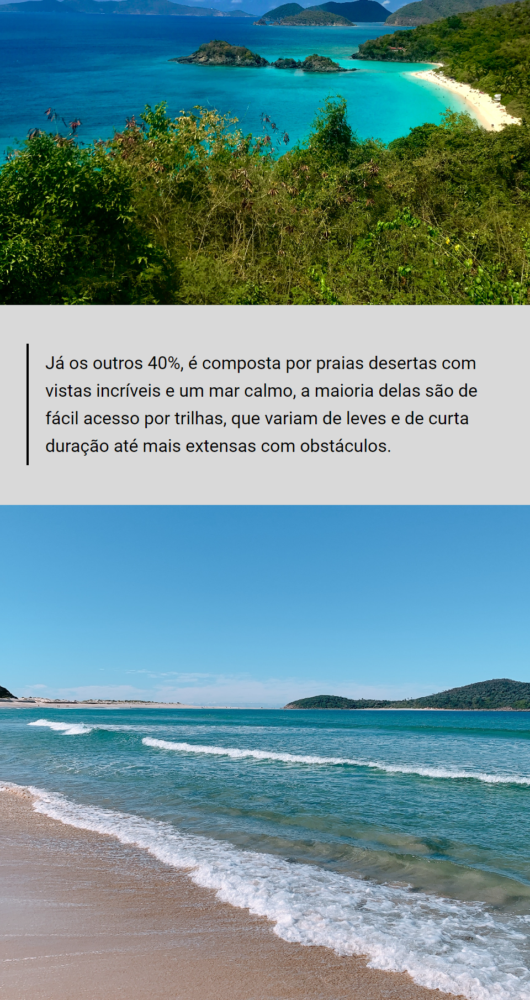
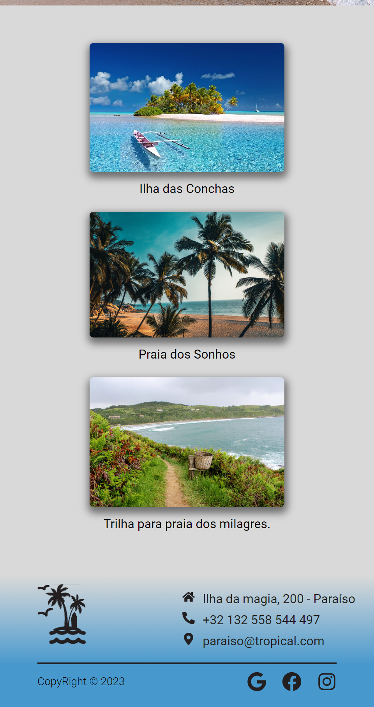

<h1 align="center">Landing page Ilha da Magia</h1>
 
Confira a aplicação aqui. <a href="https://ilha-da-magia.netlify.app" 
target="_blank">Link Deploy🔗</a>
  
## Layout 💻
  

## Mobile 📱

 

## Tecnologias utilizadas 👨🏻‍💻

- React
- Styled-components
- React-icons

